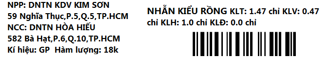

# vset-balance-app
local app server  communicate with printer and balance

### System-diagram

OS: Windows 7,10

### Guides

- create database `python utils/create_db.py`

- run all things `run.bat` (also work with virtual environment)

- run balance `python balance_service.py`

- run printer `python printer_service.py`

- run local-app (independently) `python run.py`

- view api-docs `http://127.0.0.1:5000/apidocs/`

**Install manually**

	pip install win32printing
	pip install zpl
	pip install zebra

**Content**

Font:`Segoe UI` Bold Fontsize: 13 Bold 

Text
- NPP: DNTN KDV KIM SƠN
- 59 Nghĩa Thục,P.5,Q.5,TP.HCM
- NCC: DNTN HÒA HIẾU
- 582 Bà Hạt,P.6,Q.10,TP.HCM
- NHẪN KIỂU RỒNG
- KLT: 1.47 chỉ KLV: 0.47 chỉ KLH: 1.0 chỉ KLĐ: 0.0 chỉ
- Kí hiệu: GP
- Hàm lượng: 18k
- Barcode 128

<!-- 
 -->

### APIs

**balance APIs**

https://vset.vvs.vn/parse/classes/GoldWeight/IXvPHGKTen

method: PUT

body: {"value": 5.1}

request header:

X-Parse-Application-Id

SCWASRTWK1Y9AVMP1KFC

Example

	curl -X PUT \
	-H "X-Parse-Application-Id: SCWASRTWK1Y9AVMP1KFC" \
	-H "Content-Type: application/json" \
	-d '{"value":5.2}' \
	https://vset.vvs.vn/parse/classes/GoldWeight/IXvPHGKTen

**barcode APIs**

GET

	curl -X GET \
	  -H "X-Parse-Application-Id: SCWASRTWK1Y9AVMP1KFC" \
	https://vset.vvs.vn/parse/classes/PrintJob

DELETE

	curl -X DELETE \
	  -H "X-Parse-Application-Id: SCWASRTWK1Y9AVMP1KFC" \
	https://vset.vvs.vn/parse/classes/PrintJob/D9UrWx2m0H

**barcode json format**

	{page1: “dong1 \r\ndong2  \r\ndong3  \r\ndong4”, 
	page2: {text: “dong 1  \r\n dong 2”,
			barcode: 12345678}

### Autostart with Computer

### Tools
[diagrameditor](https://www.diagrameditor.com/)

[bartender-10](http://azprint.vn/tin-tong-hop/huong-dan-crack-cai-dat-bartender-10-va-ket-noi-file-excel-de-in-ma-vach.html)

### References

[win32](http://timgolden.me.uk/pywin32-docs/win32.html) *Really important*

[win32ui](http://timgolden.me.uk/pywin32-docs/win32ui.html) *Really important*

[pywin32](https://github.com/mhammond/pywin32) *Really important*

[example win32print](http://timgolden.me.uk/python/win32_how_do_i/print.html) *Really important*

[markdown-badges](https://github.com/Ileriayo/markdown-badges)

[Python使用win32print模块设置打印机](https://www.cnblogs.com/lixiufeng1994/articles/13027576.html)

[labelary](http://labelary.com/)

[thong-tu-22](https://www.phanmemvang.com.vn/tin-tuc/tu-van/infographic-tem-nhan-nu-trang-voi-thong-tu-22.html)

[ZPL | ZEBRA Programming Language Tutorial | LABELS PRINTING](https://www.youtube.com/watch?v=DBCV2V4LPZ0)

[How to print hard copy of C, C++ program's output | C++ program for printer device](https://www.youtube.com/watch?v=GDxLs0CEdAY)

[printing-on-paper-with-python-n79](https://dev.to/pa4kev/printing-on-paper-with-python-n79)

[sqlite-browser](https://sqlitebrowser.org/dl/)

[return-plain-text-from-flask](https://stackoverflow.com/questions/57296472/how-to-return-plain-text-from-flask-endpoint-needed-by-prometheus)

[sqlite3-programmingerror-incorrect-number-of-bindings](https://stackoverflow.com/questions/16856647/sqlite3-programmingerror-incorrect-number-of-bindings-supplied-the-current-sta)

[win32ui insert an image to CreateDC()](https://stackoverflow.com/questions/73175487/win32ui-insert-an-image-to-createdc)

[Run a batch file at loading of Windows 8 and 10](https://www.computerhope.com/issues/ch000322.htm)

[Start your mining .BAT file with Windows Startup Automatically](https://www.youtube.com/watch?v=Kz2rUbjTd68)

[Create images with Python PIL](https://code-maven.com/create-images-with-python-pil-pillow)

[How to include barcode value with actual barcode Python `code128` module](https://stackoverflow.com/questions/65471637/how-to-include-barcode-value-with-actual-barcode-python-code128-module) *Really important*